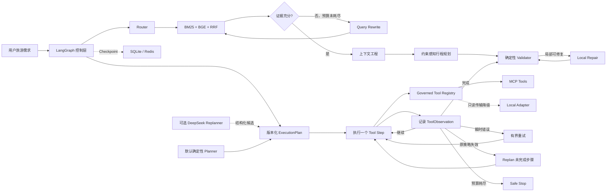

# TravelMind：评测驱动的旅游规划 Agent Harness

TravelMind 是一个面向实习面试的旅游规划 Agent 项目。它不以页面展示为重点，而是集中解决
四个问题：**如何检索可信旅游信息、如何在有限上下文中保留关键证据、如何根据工具反馈重新
规划，以及如何用评测而不是主观感觉决定组件是否上线。**

项目已经可以离线运行、注入故障、复现实验并审计简历中的指标。当前版本通过 284 个测试和
62 项发布审计。

## 30 秒看懂项目

用户提出带预算、时间、同行人和兴趣约束的旅游需求后，系统会：

1. 使用 BM25 与 BGE 向量检索召回旅游资料，并通过 RRF 融合；
2. 判断证据是否充分，不充分时在预算内改写 Query 并重试；
3. 在 Token 预算内去重、处理冲突并保留来源，构建可引用上下文；
4. 生成结构化行程，再由确定性代码重新计算预算、开放时间、预约和地点约束；
5. 执行候选搜索、可用性、预约和交通工具；中途失败时，根据 Observation 修改剩余计划；
6. 达到重试、重规划或工具调用上限后安全停止，不生成无证据行程。

它与普通 `RAG → LLM → Answer` 流水线的区别，是计划、动作、反馈和计划修订都被建模为
可检查的运行时状态，而不是藏在一个 Prompt 里。

## 系统架构



仓库中保留两条互补控制路径：证据与行程图负责 RAG、上下文和约束规划；Agentic Runtime
负责多步工具执行和中途重规划。当前工具故障实验使用确定性 Fixture，证明的是控制流契约，
不是线上订票接口的可用性。

详细架构见 [TravelMind v2 架构](docs/final-architecture-v2.md)。

## 核心结果

| 问题 | 实验结果 | 最终决策 |
| --- | --- | --- |
| Hybrid RAG 是否有效 | 105 条 Query/35 个意图簇草案上 Recall@5 为 0.971，意图簇 Bootstrap 区间为 [0.920, 1.000] | 默认使用 BM25+BGE+RRF；等待人工复核后再升级声明 |
| Cross-Encoder 是否值得加入 | 扩集后 Recall@5 从 0.971 降至 0.958，平均本地延迟从 2.82 ms 增至 216.30 ms | 保留适配器，但不进入默认链路 |
| 上下文压缩会不会损失答案质量 | 7 个真实 DeepSeek 案例中关键质量指标保持 1.000，总 Token 降低 45.3% | 选择 768-token refined-coverage Pipeline |
| LLM 行程排序是否优于规则规划 | DeepSeek 多消耗 4,475 Token，目标地点命中率提升为 0 | 默认保留确定性 Planner |
| 中途工具失败能否恢复 | 34 个受控案例覆盖4个工具位置和6种故障模式，精确契约 34/34 通过 | 选择 Plan-Act-Observe-Replan Runtime；不解释为线上恢复率 |
| Harness 工具边界是否可靠 | 官方 MCP 进程内协议、传输降级、业务错误、双路径失效和缓存故障共 6/6 契约通过 | MCP 位于受控 Registry 后；仅只读幂等工具允许缓存和本地降级 |
| Retriever 能否识别无答案问题 | 30 条无答案 Query 上原始排序器拒答准确率为 0；开发集调参的准入 Gate 在测试集达到 0.800 | 暴露排序与可回答性差异；因无人审标签暂不晋升 |
| DeepSeek 是否适合控制 Runtime | 7 次调用契约提升为 0，42.9% 需要参数归一化，共消耗 5,725 Token | 候选被门禁拒绝，确定性 Planner 仍为默认 |
| 声明是否与证据一致 | 29 个文件哈希 + 33 项语义检查，共 62/62 通过 | 冻结为 interview-v3 发布证据 |

以上都是小规模项目实验。数据集规模、标签来源和不能推出的结论记录在报告中；这里不把它们
表述为生产准确率或线上 SLO。

## 快速运行

要求 Python 3.11 或 3.12，并已安装 [uv](https://docs.astral.sh/uv/)。

```bash
git clone https://github.com/NeoZhao233/travelmind.git
cd travelmind
./scripts/bootstrap.sh
source .venv/bin/activate
travelmind demo "带父母去北京一天，预算300元，喜欢历史文化"
```

默认 Demo 使用确定性组件，不需要 API Key，也不需要下载向量模型。

运行 Stage 13 Agent Harness 故障评测：

```bash
travelmind eval-harness --root . \
  --output evals/results/my_stage13_harness.json
```

可选的真实 Redis 探针需要安装 `redis` extra 和可用的 Docker/Redis 8：

```bash
./scripts/bootstrap.sh --extra redis --extra checkpoint
docker compose -f deploy/compose.stage13.yml up -d
travelmind eval-redis-backend \
  --output evals/results/my_stage13_redis.json
docker compose -f deploy/compose.stage13.yml down
```

运行最能体现 Agentic 特性的多步故障评测：

```bash
travelmind eval-runtime-failure-matrix --root . \
  --output evals/results/runtime_failure_matrix_v2_draft.json
```

预期核心结果：

```json
{
  "case_contract_pass_rate": 1.0,
  "baseline_replan_required_recovery_rate": 0.0,
  "agentic_replan_required_recovery_rate": 1.0,
  "transient_retry_recovery_rate": 1.0,
  "completed_observation_reuse_rate": 1.0,
  "unrecoverable_safe_stop_rate": 1.0
}
```

复现扩展检索评测（需要已安装并缓存 Dense/Reranker 模型）：

```bash
travelmind eval-retrieval --root . \
  --dataset evals/datasets/retrieval_benchmark_v2.jsonl \
  --retriever hybrid --local-files-only \
  --output evals/results/my_hybrid_v2.json
travelmind eval-answerability-admission --root . \
  --output evals/results/my_answerability_v2.json
```

## 一键面试演示

```bash
./scripts/bootstrap.sh --extra dense --extra checkpoint
./scripts/interview-demo.sh
```

脚本会依次演示数据校验、旅游规划、复合依赖故障、索引原子发布、增量摄取、多步重规划和
发布审计。当前本地运行约 3 秒，不调用付费模型；真实 DeepSeek 结果读取已冻结的实验报告。

完整验证：

```bash
LANGGRAPH_STRICT_MSGPACK=true ./scripts/verify.sh
```

## 为什么选择这些技术

| 技术 | 解决的问题 | 为什么这样选 |
| --- | --- | --- |
| LangGraph | 分支、循环、重规划、Checkpoint 和显式状态 | 这些控制流已经超出顺序 Chain；循环预算也能直接进入状态和测试 |
| Pydantic | LLM、工具和持久化边界不可信 | 对 Plan、Step、Observation、Itinerary 做结构校验，并禁止多余执行字段 |
| BM25 | 地名、规则词和精确关键词召回 | 语义向量容易漏掉精确实体，词法检索提供互补信号 |
| BGE + Qdrant | 同义表达和中文语义召回 | 与 BM25 互补；Qdrant 提供可替换的向量检索接口和本地模式 |
| RRF | 融合不可直接比较的词法分数与向量分数 | 不需要把两种分数强行归一到同一尺度，且单路失效仍可降级 |
| DeepSeek | 评估 Router、答案生成和 Replanner 的模型能力 | 只作为可替换候选；必须通过质量、成本、稳定性和增量价值门禁 |
| SQLite Checkpoint | 验证跨进程恢复与幂等收据 | 适合本地可复现实验；不宣称等同于生产 PostgreSQL 或分布式事务 |
| MCP | 标准化外部工具发现、Schema 和调用边界 | 放在 Allowlist 与 Tool Policy 后；协议标准化不等于自动获得权限和容错 |
| Redis | 多进程共享 Checkpoint、短期状态与 TTL Tool Cache | 作为可选后端；缓存失败可绕过，Checkpoint 失败必须关闭而不是中途换库 |
| Pytest + JSON 报告 | 防止“改 Prompt 后只看几个示例” | 固定数据、故障注入、回归门禁和版本化报告共同约束结论 |

更完整的技术取舍在 [ADR 目录](docs/adr/)；面试追问答案在
[面试问题库](docs/interview/questions.md)。

## 失败时如何兜底

| 失败 | 处理方式 | 不会做什么 |
| --- | --- | --- |
| BM25 或 Dense 单路失败 | 使用另一通道并标记 degraded | 不把降级请求统计为健康请求 |
| 两路检索都失败 | 安全失败 | 不让模型脱离证据生成行程 |
| 工具超时 | 在单步预算内重试 | 不把瞬时错误直接误判为需要 Replan |
| 预约、路线或响应 Schema 永久失败 | 保留成功 Observation，替换未完成步骤 | 不重复已经完成的候选检索 |
| MCP 传输断连 | 仅只读幂等工具可切换本地 Adapter | 不把远程业务拒绝误判成网络故障 |
| Redis Cache 失效 | 绕过缓存继续调用原始只读工具 | 不让性能优化组件变成业务单点 |
| Redis Checkpoint 失效 | 明确失败并保留故障类型 | 不在执行中途切换状态库造成历史分叉 |
| LLM Plan 字段越权或地点未知 | Schema、工具签名和地点 Allowlist 拒绝；回退确定性 Planner | 不把 LLM 输出直接转成工具调用 |
| 生成内容引用不存在的证据或地点 | Grounding Validator 拒绝 | 不声称拥有通用“幻觉检测器” |
| 重试、Replan 或总 Tool Call 超限 | Safe Stop 并记录故障层 | 不允许 Agent 无限循环 |
| Checkpoint 后恢复 | 恢复控制状态，并用幂等收据避免重复副作用 | 不宣称 Exactly Once |

故障会按照 retrieval、tool、generation、validation、orchestration 五层记录最早可观察边界；
多因素问题允许记录 contributing layers，不伪造唯一根因。详见
[可靠性设计](docs/reliability.md)。

## 真实 DeepSeek 实验

只有复现真实模型实验时才需要 Key：

```bash
export DEEPSEEK_API_KEY="your-key"
travelmind eval-deepseek-runtime --root . \
  --output evals/results/my_deepseek_runtime_run.json
```

Key 不应写进仓库。`.env` 和 `.env.local` 已被忽略。缺少 Key 时 CLI 会停止真实模型实验，
不会把确定性回退的结果冒充成模型效果。

最终 DeepSeek Runtime 候选没有被选中。这是项目刻意保留的负结果：模型能返回合法 JSON，
不代表它比确定性策略更好；Fallback 后的 100% 完成率，也不等于模型本身 100% 成功。

## 项目结构

```text
src/travelmind/
├── agentic/       # Router、Evidence Grader、Query Rewrite 与模型 Provider
├── retrieval/     # BM25、Dense、Qdrant、RRF、Reranker 与容错
├── context/       # Token 预算、覆盖、去重、冲突处理和来源保留
├── planning/      # 候选规划、约束校验和局部修复
├── runtime/       # ExecutionPlan、ToolObservation、Act/Replan Runtime
├── mcp/           # 官方 MCP Server、Client Adapter 与结构化工具边界
├── ingestion/     # 快照、Freshness、隔离构建和原子发布
└── evaluation/    # 指标、A/B、故障注入、回归门禁和发布审计

evals/
├── datasets/      # 版本化种子数据与故障案例
└── results/       # 实验报告，包括被拒绝的候选

docs/
├── adr/           # 为什么选这个技术、为什么不选替代方案
└── interview/     # 简历描述、讲述稿和高频追问
```

## 面试材料

- [一页简历版项目描述](docs/interview/resume-project.md)
- [30 秒、2 分钟和 5 分钟讲述稿](docs/interview/project-narrative.md)
- [技术选型、故障兜底与指标边界问题库](docs/interview/questions.md)
- [Agentic Runtime 设计与实验](docs/stage11-agentic-runtime.md)
- [Agent Harness、MCP 与 Redis](docs/stage13-agent-harness.md)
- [v3 发布说明](docs/release-v3.md)
- [62 项发布审计报告](evals/results/release_v3_audit.json)

## 当前边界与后续工作

- 扩展检索集包含 105 条 Query/35 个意图簇，由项目生成且未做独立人工复核；只能以“项目
  自建合成评测集”限定呈现，不能称为人工标注或外部 Benchmark。
- Runtime 已扩展为 34 个项目自建故障案例，但仍使用 Fixture Tool；尚未证明真实预订 API
  可靠性。
- DeepSeek A/B 样本较小，结果只用于当前候选选择，不代表模型通用能力。
- SQLite 只证明本地跨进程恢复；生产环境仍需 PostgreSQL、分布式锁和真实并发测试。
- Stage 13 已实现 Redis Cache/Checkpoint Adapter 和真实探针命令，但当前开发机缺少可运行
  的 Docker Engine，尚未提交真实 Redis 生命周期报告；简历不能声称 Redis 集群恢复能力。
- PDF Stage 10A 已完成安全获取与快照；版面解析、OCR、页码引用和 PDF RAG 评测仍待完成。
- 当前没有前端和线上部署，重点是 Agent、RAG、上下文工程、可靠性与评测闭环。

开发阶段和后续计划见 [Roadmap](docs/roadmap.md)。
