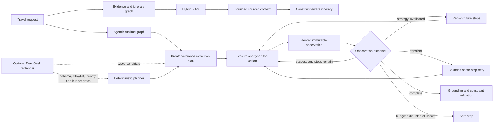

# TravelMind v2 agentic runtime architecture

## Two cooperating control paths

The original itinerary graph solves evidence acquisition and constraint-aware generation. The
Stage 11 runtime adds the missing execution loop: an explicit plan, one action at a time, typed
feedback, and replacement of only the unfinished strategy. These paths are complementary rather
than duplicate orchestration layers.

## Runtime contracts

| Contract | Responsibility | Failure behavior |
| --- | --- | --- |
| `ExecutionPlan` | Stable goal and plan ID, monotonic revision, ordered dependencies | Reject invalid graph as orchestration failure |
| `RuntimeStep` | Allowlisted tool, typed kind, exact arguments, attempt budget | Reject or deterministically normalize runtime-owned fields |
| `ToolObservation` | Immutable success/failure evidence with provenance | Failed observations never become itinerary evidence |
| Retry policy | Repeat the same action only for transient failures | Stop at per-step and global call bounds |
| Replanner | Replace unfinished steps after strategy-invalidating feedback | Preserve successful observations across revisions |
| Grounding validator | Check evidence IDs, place IDs, provenance, and constraints | Attribute earliest failing layer and fail closed |

Retry, repair, and replan are separate operations: retry repeats an action, repair changes invalid
output, and replan changes the remaining strategy. Every mechanism has its own counter in state.

## Selected and rejected planning policies

The deterministic multi-step planner remains the default. On four controlled cases, the agentic
runtime recovered from intermediate booking/travel failure in all recoverable cases, reused prior
candidate-search observations, and safely stopped the unrecoverable case. The fixed no-replan
baseline recovered from none of the intermediate failures.

The real DeepSeek replanner is injectable but not selected. Its fallback-inclusive contract rate
matched the deterministic planner, so measured lift was zero. Although all seven model plans were
accepted after canonicalization, only 57.1% were strict and 42.9% required deterministic argument
normalization. It also consumed 5,725 tokens with roughly 1.08 seconds mean candidate latency. The
positive-lift and normalization gates therefore retained the deterministic default.

## Safety and attribution boundary

- Retrieval failures describe missing, unusable, or failed evidence acquisition.
- Tool failures describe authenticated external actions and their typed responses.
- Generation failures describe unknown entities, citations, or unsupported claims emitted despite
  admissible evidence.
- Validation failures describe recomputed business-constraint violations.
- Orchestration failures describe invalid plans, dependency graphs, budgets, and loop termination.

Attribution records the earliest observed boundary and optional contributing layers; it does not
claim perfect causal diagnosis. LLM output, retrieved text, and tool responses remain untrusted.
Termination, schema checks, provenance admission, hard constraints, and release selection stay
deterministic.

## Evidence boundary

Stage 11 evidence uses four project-authored fixture cases and is not independently reviewed. It
proves control-flow contracts and failure behavior, not live booking API reliability or production
quality. The older retrieval/context metrics remain small pilot evidence. The v1 release stays
immutable; `travelmind-interview-v2` adds this runtime as a separately pinned release.
