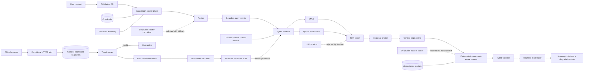
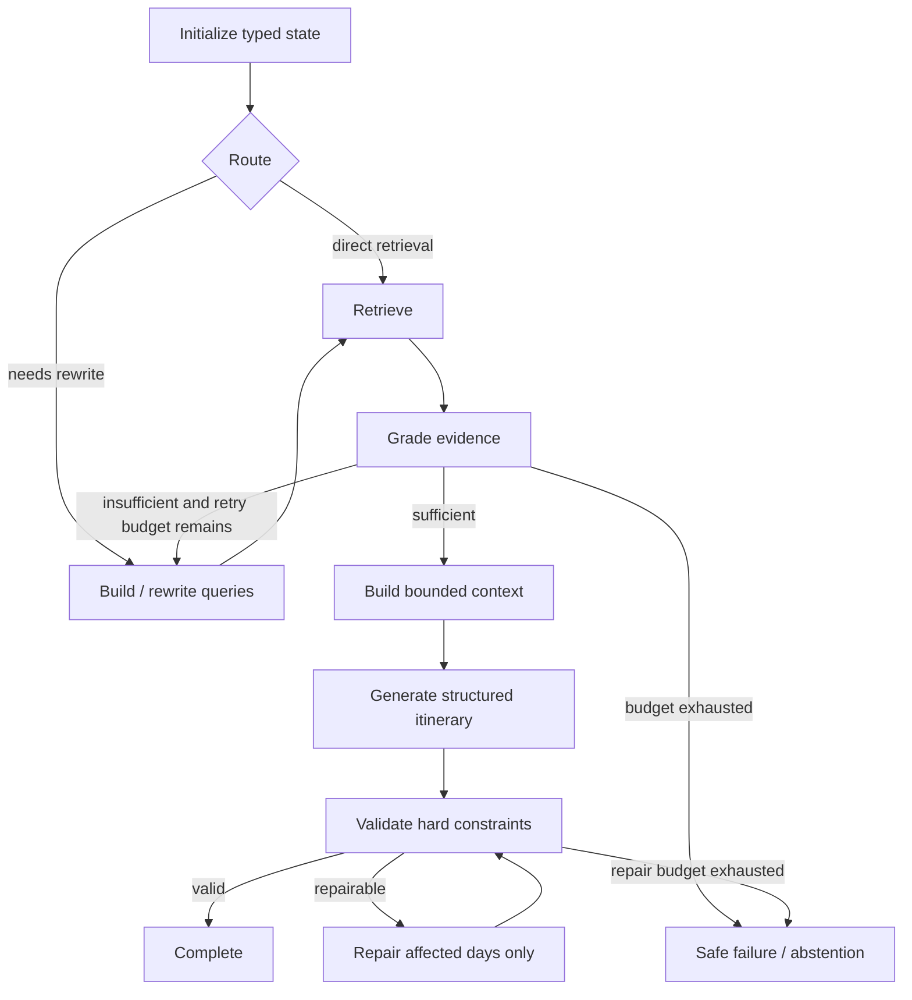

# TravelMind v1 final architecture

## Runtime and data planes

Solid edges are selected v1 behavior. Dashed edges are evaluated model candidates that remain behind
interfaces or were rejected by measured gates. The local Qdrant, SQLite, and in-memory stores prove
contracts but are not presented as multi-instance production infrastructure.

## LangGraph state flow

Loop bounds are part of state, so rewrite and repair cannot run indefinitely. Checkpoints persist the
observed state and next node; idempotency receipts separately protect repeatable external operations.

## Selected v1 stack

| Layer | Selected | Why |
| --- | --- | --- |
| Orchestration | LangGraph | Explicit state, branching, bounded loops, checkpoint injection |
| Retrieval | BM25 + BGE-small-zh dense + RRF | Complementary lexical/semantic recall and channel degradation |
| Reranking | None by default | Cross-encoder reduced pilot Recall/MRR/NDCG and added latency |
| Agent policies | DeepSeek Router; deterministic Grader/Rewriter fallback | Only Router passed component gates |
| Context | 768-token refined coverage pipeline | Smallest passing budget; deterministic provenance-preserving refinement |
| Planning | Deterministic explainable greedy + bounded repair | DeepSeek ranking added cost with zero measured quality lift |
| Evaluation | Exact metrics + frozen gates; Judge v1 rejected | Judge agreement failed; hard constraints remain deterministic |
| Persistence | In-memory tests, SQLite local proof, PostgreSQL target | Honest separation of test/local/production workload classes |
| Ingestion | Conditional fetch + immutable snapshots + typed incremental index | Freshness, reproducibility, quarantine, atomic promotion |

## Trust boundaries

- LLM output, retrieved text, HTTP responses, and parser output are untrusted inputs.
- Hard constraints, freshness admission, schema checks, retry budgets, and release gates are code.
- A fallback completion is observable degradation, not a healthy request.
- Missing admissible evidence produces abstention or failure, never an unsupported itinerary.
- Exact-once is not claimed; checkpoint recovery and idempotency receipts address different risks.
